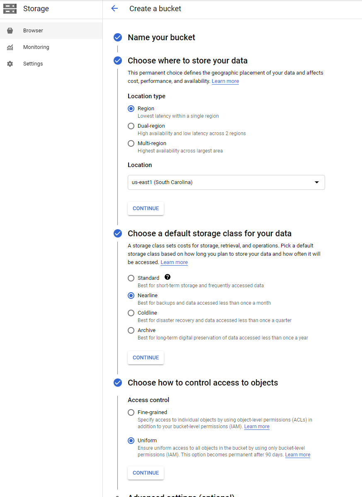

# Perforce GCS Backup Scripts

This directory contains scripts that can be used to backup a Helix Core deployment into
Google Cloud Storage (GCS). They support the commit-edge architecture and will backup
individual checkpoints.

## Prerequisites

This guide assumes you have a Helix Core server (or servers, in the commit-edge architecture)
running on Linux. It furthermore assumes the p4d instances run on the Google Cloud Platform,
although the scripts can be easily adjusted to run elsewhere.

Additionally, you will need a Google Cloud account with billing enabled to use GCS.

## Strategy

The scripts in this directory implement a backup strategy that consists of using two GCS buckets:

### 1. Incremental

It is used for a nighlty rsync operation that copies only the versioned files that changed.

This bucket allows both writes and deletes because Perforce will sometimes replace the contents
of versioned files and/or remove them. This is essentially a live mirror of the versioned data
and should update reasonably fast. However, it offers a higher attack surface since a bad actor
could theoretically delete files if they gained access to the backup service account.

### 2. Regular

It is used for a nighlty checkpoint backup and a full monthly versioned files backup.

This bucket only allows write operations, meaning that a malicious user would have harder time
deleting the files. However, the full backup operation takes a much longer time than an incremental
rsync.

### Note on retention

GCS allows to configure file rentention per buckets. It is recommended to set indefinite retention
on the Incremental bucket and a 90-day retention for the Regular bucket.

However, these parameters (as well as the backup cadence) can be adjusted based on the needs.

### Offline root

The nightly backup screen uses an offline copy of the Helix Core database to avoid locking the
server during the checkpoint operations. Please make sure that it has been created and seeded with
from a main server checkpoint.

## Setup

## GCS Buckets

### Create buckets

Create the buckets by navigating to Storage | Browser in the Google Cloud Console and
select "Create Bucket":



Bucket names must be globally unique. One easy way of addressing this requirement is to use
the project name as a suffix. For example, if your project is called my-perforce-123, you
can name the Incremental bucket *incremental-my-perforce-123*.

There are a number of considerations for choosing the location type and storage class.
We recommend reviewing Google Cloud documentation to understand the tradeoffs involved in
making those choices. For example, a Multi-region location type would incur the highest cost
but will provide the highest availability. A Nearline storage class could be appropriate for
backups, but you would need to evaluate this based on cost and performance characteristics.

We recommend configuring a uniform access to all objects in the bucket.

Repeat the bucket creation process for the incremental and regular buckets.

### Granting permissions

You can grant permissions by opening bucket details and navigating to the Permissions tab.

-  For the incremental bucket, grant the Storage Object Admin role to the
   Perforce VM service account.
-  For the regular bucket, grant the Storage Object Creator role to the
   Perforce VM service account.

Note: A GCP VM additionally needs the Access scopes to be configured to enabled writing
to Storage (e.g. granting Read Write or Full Storage scopes).

Note: If you change the settings but still get 403 when writing via gsutil, the issue can
sometimes be fixed by removing the ~/.gsutil folder.

## Configuring Perforce user

The scripts assume that a dedicated Linux user has been created on the machine running Helix Core.
Assuming that this user is named "perforce", please make sure that it can run the `p4 info` command.

The simplest way of doing this is by adding the P4PORT setting to the .profile file. For example:

```
echo "export P4PORT=ssl:1666" >> ~/.profile
```

Note: The reason we are using the "perforce" user is that by default, it has access to the
Helix Core metadata, checkpoints and version files. It might be a good idea to use a more restricted
user as long as it can run p4d commands and access the versioned files and checkpoints.

## Make sure the perforce user can run gcloud

Login as the perforce user (e.g. `sudo -u perforce -i`) and make sure you can run the
gcloud command. Many issues can be resolved by installing the latest version of gcloud:
https://cloud.google.com/sdk/docs/install


## Copying the backup scripts

Simply place the two backup scripts (nightly_backup.sh and monthly_backup.sh) in any folder
readable by the perforce user and make sure they are executable (via chmod u+x).

## Setting up the offline root

This backup strategy uses a complete copy of the metadata in offline mode to prevent locking the
main database during checkpoint operations.

To create an offline root directory:

1. Create a new directory on a disk which has enough storage to hold metadata. Note that the script
expects the server id to be part of that path. For example, if the server is named "demo", an
offline root directory could be /opt/perforce/offline:

```
mkdir -p /opt/perforce/offline/demo
```

2. Restore the latest checkpoint there. For example:

```
p4d -jr -r /opt/perforce/offline/demo PATH_TO_LATEST_CHECKPOINT
```

## Manual testing

### Dry-run

First, make sure the scripts run successfully in dry-run mode.
For example:

```
./nightly_backup.sh -d regular-my-perforce-123 incremental-my-perforce-123 /opt/perforce/offline/
./monthly_backup.sh -d regular-my-perforce-123
```

Make sure that all paths are correct. Both scripts parse the output of p4d -cshow to infer
the correct paths. However, in a multi-server environment, they may return icorrect values.
Please make sure that checkpoints_path and depot_path point to correct locations.

### Actual backup

If the backup scripts succeeded in the dry-run mode, you can run them in production mode.
Please note that this can take a very long time for large depots.

It might be a good idea to test then on smaller servers first.

For example:

```
./nightly_backup.sh regular-my-perforce-123 incremental-my-perforce-123 /opt/perforce/offline
./monthly_backup.sh regular-my-perforce-123
```

## Setting up cron jobs

Once you've made sure the backup scripts operate as expected, you should set them up to run
automatically. It's easy using the crontab service. For example:

```
# Nightly backups - run every night at 3am
0 3 * * * /opt/perforce/backup/nightly_backup.sh regular-my-perforce-123 incremental-my-perforce-123 /opt/perforce/offline > /dev/null 2&>1

# Monthly backups - run on the first Saturday of each month at 4am
0 4 * * 6 [ `date +\%d` -le 7 ] && /opt/perforce/backup/monthly_backup.sh regular-my-perforce-123 > /dev/null 2&>1
```

## Edge considerations

The backup scripts support the Helix Core commit-edge architecture,
meaning that they can be used to backup edge-specific data. There is a special -e flag to tell
the scripts they are running on the edge servers.

A few notes:

- The scripts assume that the only depot files that need to be backed up from the edge are
  under spec depot. If you require backing up more (e.g. shelves or archive depots) you would
  need to take this into consideration. Note that one way of not having to deal with shelved files
  on the edges is to force-promote shelves to the main commit.

- Running a journal rotation on the commit forces the same thing to happen on the edges.
  Make sure to schedule the edge backup a bit after the main commit to make sure it happened
  (e.g. by starting the nighly backup 15 minutes later).

- The current script does a full checkpoint backup from the edge - this can be optimized by
  exporting and backing up only the edge-specific tables.
