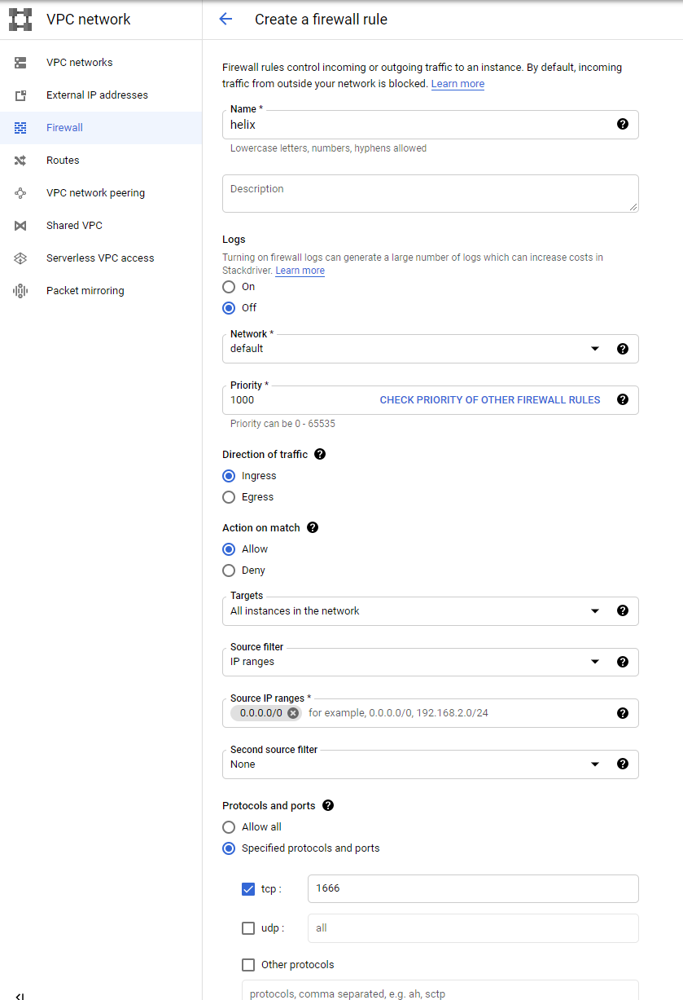

# Configuring Helix Core with Google single-sign-on

This guide shows how to configure a single sign-on (SSO) user experience for the Helix Core
source control system by Perforce Software Inc using Google Identity.

## Introduction

Helix Authentication Service (HAS) is an open-source product by Perforce Software Inc that
allows enabling SSO experiences for certain Perforce products using either OpenID Connect
and SAML 2.0 authentication protocols.

More information about HAS can be found here:
https://www.perforce.com/downloads/helix-authentication-service

This guide provides step-by-step instructions on how to install a single instance of the
Helix Core software on the Google Cloud Platform and how to configure HAS using OpenID Connect,
enabling users to sign into Helix Core using Google Identity
(such as a Gmail or a Google Workspaces account).

Please note that this guide is taking a number of shortcuts to keep it simple. The last section
of this guide will focus on some important considerations regarding this setup.

## Prerequisites

In order to complete the steps in this guide, you would need a Google Cloud account
with billing enabled. The Google Cloud Platform offers a free trial that should be sufficient to
cover all of the steps in this guide.

## Setting up Helix Core with HAS and Google Identity

### Creating a GCE VM to host Helix Core and HAS

We will be using a Google Compute Engine virtual machine to install both Helix Core and HAS.

Create a new VM by navigating to the Google Cloud Console, selecting Compute Engine and clicking "Create Instance".

Select an E2-medium instance with the Ubuntu 18.04 LTS image and a 100GB HDD.

_Note that the machine specs are mostly artbitrary - HAS doesn't require powerful VMs
but you might consider more powerful specs if you were to actually run Helix Core in production._


Alternatively, you can create the instance using the gcloud command:

```
gcloud compute instances create perforce --zone=us-central1-a --machine-type=e2-medium --image=ubuntu-1804-bionic-v20210129 --image-project=ubuntu-os-cloud --boot-disk-size=100GB --boot-disk-type=pd-standard
```

Please note that for the purposes of keeping this simple, the VM has been configuring using
an ephemeral external IP. In an actual production environment, you'll probably want to assign
a permanent external IP and use it in conjuction with a custom domain name.

Take a note of the VM's external IP address, you will need it in the subsequent steps.
We will refer to is as VM_EXTERNAL_IP in the rest of the guide.

### Configuring OAuth

In order to use HAS with Google Identity, you will need to configure an OAuth 2.0 client.
In the Google Cloud Console, navigate to API & Services and select Credentials.
Click on Create Credentials, select "OAuth client ID" and pick "Web application"
as the Application type:


You can name the credentials "HAS Client" (the name does not matter).

Note that you will need to provide the authorized Authorized redirect URIs.
Since we are not using a domain name but an IP address, we would need to use a special domain,
xip.io, that does the redirect. You can see the following post for more details:
https://stackoverflow.com/questions/14238665/can-a-public-ip-address-be-used-as-google-oauth-redirect-uri

**Note: In a production environment, you should always use your own domain name!**

The two URIs you'll need to list are:

-  https://VM_EXTERNAL_IP.xip.io:3000
-  https://VM_EXTERNAL_IP.xip.io:3000/oidc/callback

If this the first time you are creating OAuth credentials, you will also need to configure
an OAuth consent screen.

Once you have created the credentials, take note of the Client ID and the Client Secret.
These values will be needed when configuring HAS.

### Configuring the firewall

We will most likely want to access the Perforce VM from outside of the default VPC network.
For the purpose of this exercise, we will open up the VPC firewall to allow unrestricted
access to our VMs on ports 1666 (Helix Core) and 3000 (HAS).

**Please consult a security or network engineer when adapting this to your environment.**

To open up all VMs on your GCP network to incoming traffic on ports 1666 and 3000, follow these steps:

-  In Google Cloud Console, navigate to VPC Network / Firewall
-  Click on "Create Firewall Rule"



You can give your rule any name (e.g. "helix"). Select "All instances in the network"
as targets, choose 0.0.0.0/0 as source IP ranges and specify TCP ports 1666.

**Repeat the same process for the HAS port 3000.**

Note: While this rule is fine for testing, consider restricting them to specific VMs by using
target tags.

### Installing the software

You will need to ssh into the VM to install Helix Core and HAS.
This can be done by clicking the "SSH" button in the VM instance list in the Google Cloud Console.
Alternatively, you can use the gcloud command:

```
gcloud compute ssh perforce
```

#### Installing and configuring Helix Core

The full guide on installing Helix Core is available here:
https://www.perforce.com/manuals/p4sag/Content/P4SAG/install.linux.packages.install.html

In a nutshell:

```
wget -qO - https://package.perforce.com/perforce.pubkey | sudo apt-key add -
echo 'deb http://package.perforce.com/apt/ubuntu xenial release' | sudo tee /etc/apt/sources.list.d/perforce.list
sudo apt-get update
sudo apt-get install -y helix-p4d
```

Now follow the on-screen instructions to configure Helix Core.
This is normally done by running the following command:

```
sudo /opt/perforce/sbin/configure-helix-p4d.sh
```

You can use the following configuration values:

-  Perforce Service name: demo
-  Perforce Server root: /opt/perforce/servers/demo
-  Perforce Server unicode-mode: y
-  Perforce Server case-sensitive: y
-  Perforce Server address: ssl:1666
-  Perforce super-user login: super
-  Perforce super-user password: YOUR_SECRET_PASSWORD

The Perforce server should be now up and running.

Run the following commands on another machine to test the installation and firewall rules:

```
p4 -p ssl:VM_EXTERNAL_IP:1666 trust
p4 -u super -p ssl:VM_EXTERNAL_IP:1666 depots
```

If everything worked correctly, you should be prompted for a super password and then be able
to see the a list of depots.

#### Installing and configuring HAS

The full guide on installing Helix Core is available here:
https://www.perforce.com/manuals/helix-auth-svc/Content/HAS/install-has.html

First, install the appropriate version of node.js:

```
sudo apt-get install -y build-essential curl git
curl -sL https://deb.nodesource.com/setup_14.x | sudo -E bash -
sudo apt-get install -y nodejs
```

With node.js installed, install HAS:

```
sudo apt-get install -y helix-auth-svc
```

To configure HAS, run the following command:

```
sudo /opt/perforce/helix-auth-svc/bin/configure-auth-service.sh
```

Use the following configuration values:

-  URL for the authentication service: https://VM_EXTERNAL_IP.xip.io:3000/
-  Protocol: OICD
-  URI for OIDC issuer: https://accounts.google.com
-  OIDC client ID: CLIENT_ID_SAVED_EARLIER
-  OIDC client secret: CLIENT_SECRET_SAVED_EARLIER

Answer "Yes" to "Do you wish to continue?"

To test that the server is up and running, you can navigate to https://VM_EXTERNAL_IP.xip.io:3000/.

Please note that your browser may block this because the site is using a default self-signed
TLS certificate. In Chrome, you can click on "Advanced" when this happens to proceed.

**Do not use self-signed certificates in production!**

#### Installing and configuring HAE

The last step in setting up SSO is to install the Helix Authentication Extension, or HAE.
The sources and instructions are available here:
https://github.com/perforce/helix-authentication-extension

You can download an extract HAE using the following commands:

```
wget https://github.com/perforce/helix-authentication-extension/archive/2020.2.zip
sudo apt-get install -y unzip
unzip 2020.2.zip
```

To install the extension:

```
cd helix-authentication-extension-2020.2/
p4 extension --package loginhook
p4 extension --install loginhook.p4-extension -y
```

To configure the extension:

```
p4 extension --configure Auth::loginhook
```

Modify the following fields:

-  ExtP4USER: super
-  Auth-Protocol:oidc
-  Service-URL:  https://VM_EXTERNAL_IP.xip.io:3000/

To configure the instance:

```
p4 extension --configure Auth::loginhook --name Auth::loginhook-all
```

Modify the following fields:
-  enable-logging: true
-  name-identifier: email
-  user-identifier: email

Finally, restart Helix Core:

```
sudo -u perforce p4dctl restart -a
 ```

#### Creating an SSO user and testing

At this point, you should have a functioning SSO setup. The last step is to create a user and test.

Suppose that you have a Google Worspace user called testuser@yourdomain.com

Run the following command:

```
p4 user -f testuser
```

Edit the user, making sure the email address is correct.

If you now run the p4 users command, you should see testuser@yourdomain.com listed.

Finally, run this on another machine:

```
p4 -u testuser -p ssl:VM_EXTERNAL_IP:1666 depots
```

## Important considerations

This guide has been written with the focus on quick demonstration and minimum prerequisites.
However, a lot of shortcuts taken here should not be used in a production environment.
Here is a list of important considerations:

### TLS Certificates

Both Helix Core and HAS ship with testing self-signed TLS certificates. These certificates should never
be used in production. You would need to purchase TLS certificates from a certification authority
to replace those.

### Firwall and access

We have exposed the VMs directly to the internet. This is unlikely to be a good security
best practice even though Helix Core is used with TLS. Consider using measures such as VPN
or an Identity-Aware Proxy to secure your production environment. Work with a security specialist
to make sure your deployment is secure.

### Domain name

While it is possible to use Helix Core and HAS with static IP addresses, it is a good idea to
use a custom domain name.

### VMs

We have used a single Google Compute Engine VM to install both Helix Core and HAS.
In a production environment, it is likely that you would want to have a dedicated VM for Helix Core
and use much bigger specs (you can also deploy a Commit-Edge architecture on GCP).

In that case, you may consider using a smaller VM specifically for HAS.

An interesting alternative is to deploy HAS to App Engine Flex as a custom container,
although there might technical challenges in doing so due to App Engine's use of a reverse proxy
to manage traffic through a load balancer.

## Logs

In case things go wrong with the Perforce setup, these are the logs to lookout for.

NOTE: SERVER_ROOT represents the place where the Perforce server is installed. In this
      tutorial it would be `/opt/perforce/servers/demo`.
NOTE: HAS_ROOT represents the HAS installation (default: `/opt/perforce/helix-auth-svc`).

- Perforce logs: these are the logs of the Perforce application itself.
  - Location: `${SERVER_ROOT}/logs/log`
- HAE: these represent the auth extension logs within the Perforce application. These *are not* the
  logs of the HAS server.
  - Location: `${SERVER_ROOT}/root/server.extensions.dir/<SOME ALPHANUM ID>/1-data/log.json`
- HAS: these are the logs of the HAS application.
  - Location: `${HAS_ROOT}/auth-svc.log`
